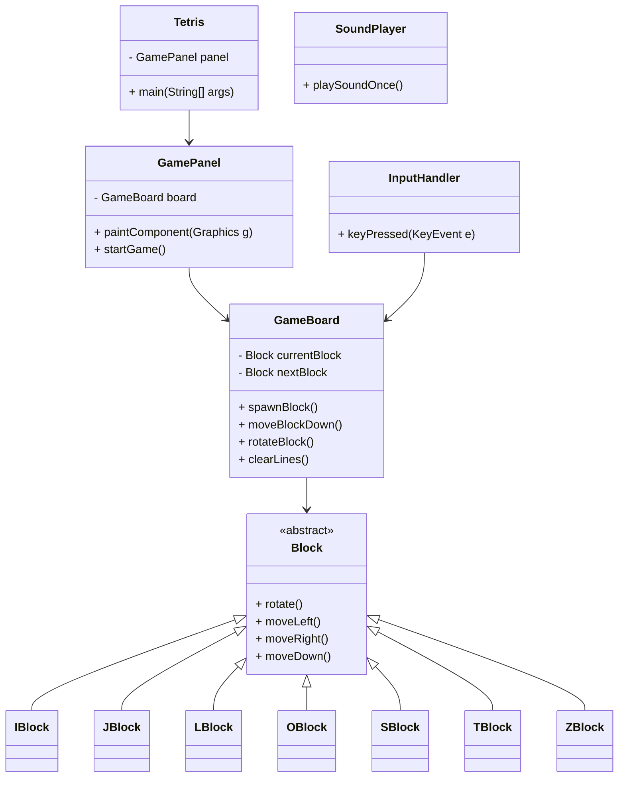
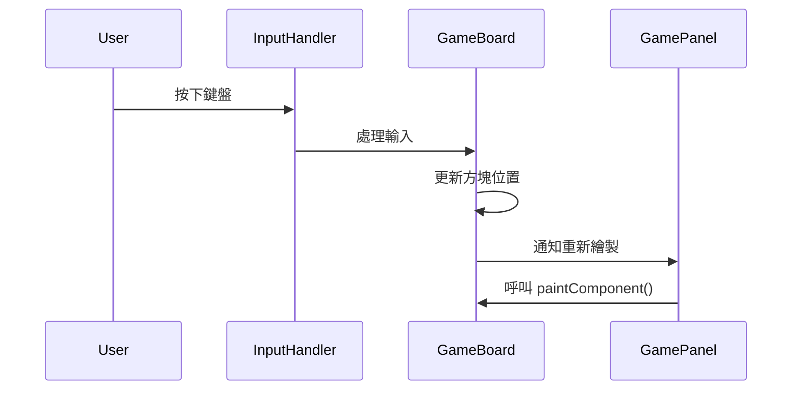
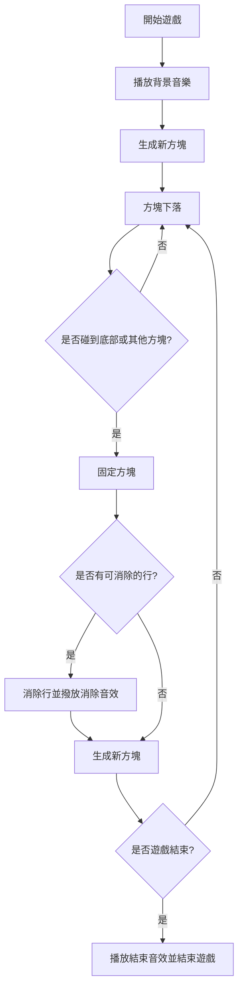

# java-B11207030-Eason-B11207042-Tony
尚未完成功能:T轉、生成在非遊玩區域、開始和結束畫面、儲存方塊、暫停、道具(未定)

v1.1: 新增面板10×20網格線、消行機制

v1.2: 調整畫面大小、新增計分功能和隨分數提高下落速度

v1.2.1: 加入End game功能、方塊顏色、修正一些寫法

v1.3: 預覽下個方塊(測試出End game bug)

v1.3.1: 新增反轉功能和快速下落

v1.3.2: 新增背景音樂、消除音效、結束音效

v1.3.3: 新增消除動畫、遊玩區域下移(生成在區域上的功能暫有問題)

## Class

## 時序圖

## 流程圖

          
