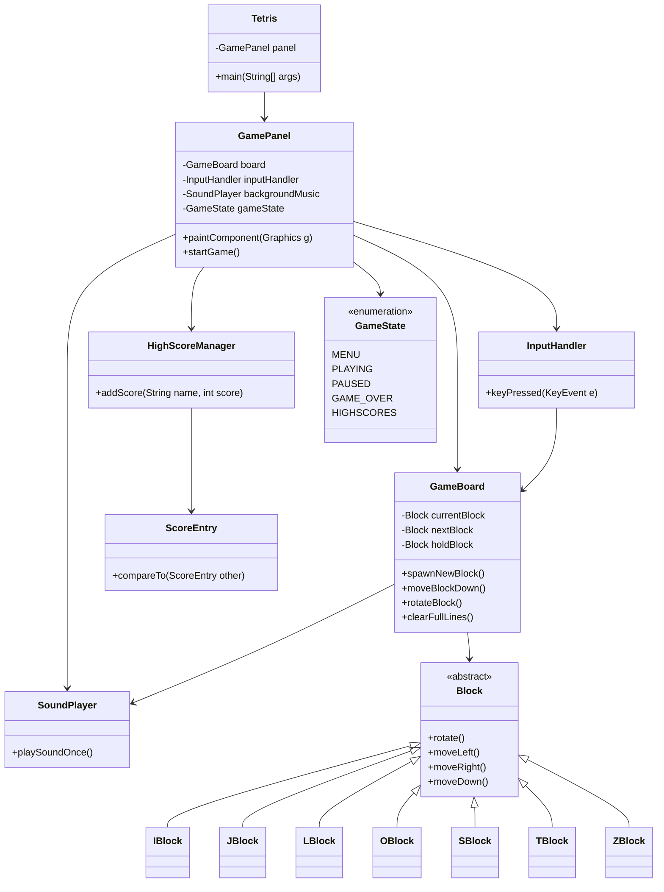
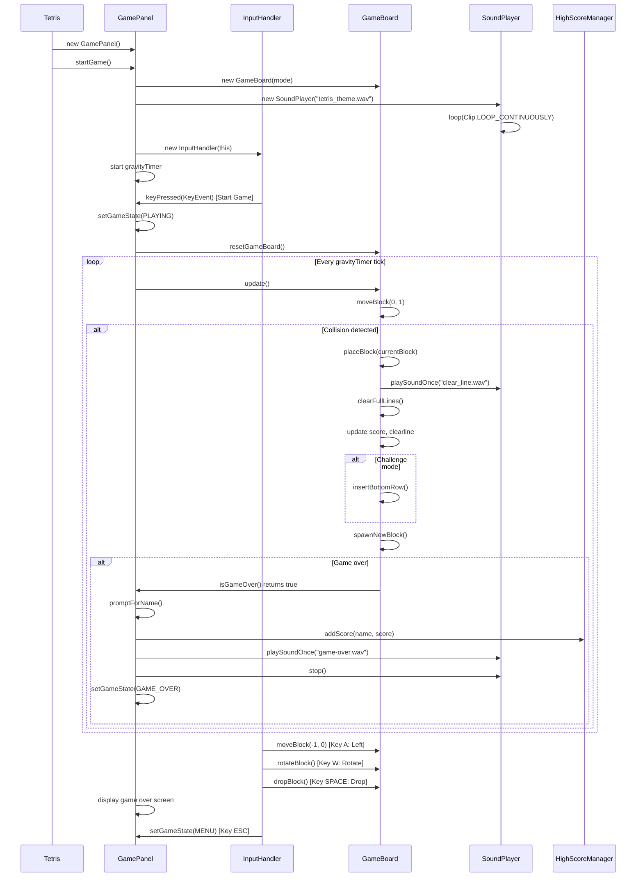
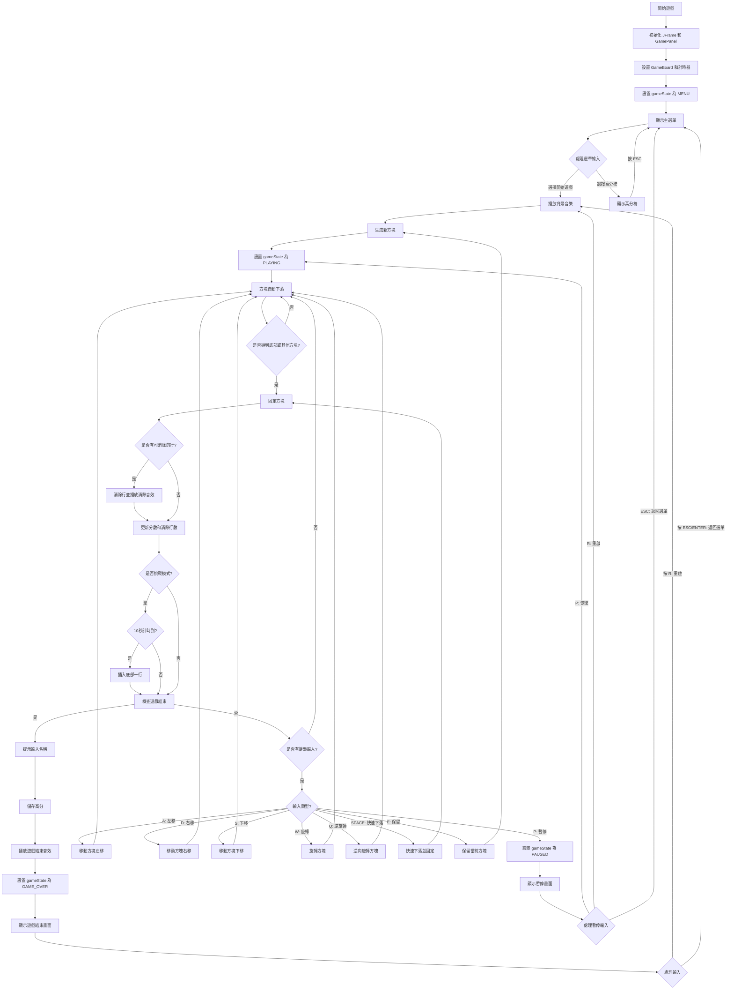

# java-B11207030-Eason-B11207042-Tony

v1.1: 新增面板10×20網格線、消行機制

v1.2: 調整畫面大小、新增計分功能和隨分數提高下落速度

v1.2.1: 加入End game功能、方塊顏色、修正一些寫法

v1.3: 預覽下個方塊(測試出End game bug)

v1.3.1: 新增反轉功能和快速下落

v1.3.2: 新增背景音樂、消除音效、結束音效

v1.3.3: 新增消除動畫、遊玩區域下移(生成在區域上的功能暫有問題)

v1.3.4: 更改按鍵(wasd)，方塊生成在區域上方(判斷結束部份還有問題)

v1.4.0: 加入Hold功能

v1.4.1: 更改Hold顯示問題

v1.4.2: 修改Hold功能、加入首尾頁功能

v1.4.3: 新增menu功能的按鍵、結束時能回到主選單

v1.4.4: 主頁面調整功能實裝、實裝調整音量(70以下聲音太小)、新增挑戰模式每十秒上升一階障礙

v1.4.5: 修改調整速度功能，新增暫停功能

v1.4.6: 修改輸入鍵位、加速標準、更改輸入程式碼、更改gameover判斷、新增下落預覽功能

v1.4.7: 顯示調整、暫停時可以重來或回主畫面、新增排行榜功能

## 組員

| 學號      | 姓名   |
| ------- | ------- |
| B11207030 | 高翊峰 |
| B11207140 | 蘇峰玄 |

---

## 分工說明

| 負責人      | 項目類別 |
| ------- | --------------- |
| 高翊峰    | 調整畫面、消行機制、End game功能、方塊顏色、Hold功能、首尾頁功能、menu頁面按鍵、新增挑戰模式 |
| 蘇峰玄    | 調整畫面、計分功能、隨分數提高下落速度、預覽方塊、反轉功能、快速下落、新增音效、消除動畫、暫停功能、下落預覽功能、排行榜功能|

---

## 報告影片連結

* [點我看遊戲演示影片](https://youtu.be/Wx4hFKNItk8)

---

## 遊戲說明
### 一、 主頁面(上下左右鍵選擇)
•排行榜
•調整音量
•調整速度
•選擇模式
•開始遊戲
### 二、 遊戲頁面
•A、D鍵調整左右
•Q、W鍵旋轉方塊
•E鍵保留方塊
•S鍵加速下落
•Space鍵確定下落
•P鍵暫停
### 三、 暫停頁面
•P鍵繼續遊戲
•R鍵重新開始遊戲
•ESC鍵回主選單
### 四、 結束頁面
•輸入名字登入排行榜
•R鍵重新開始遊戲
•ESC鍵回主選單
### 五、 挑戰模式
•每十秒上升一格障礙

---
## Class

## 時序圖

## 流程圖

          
